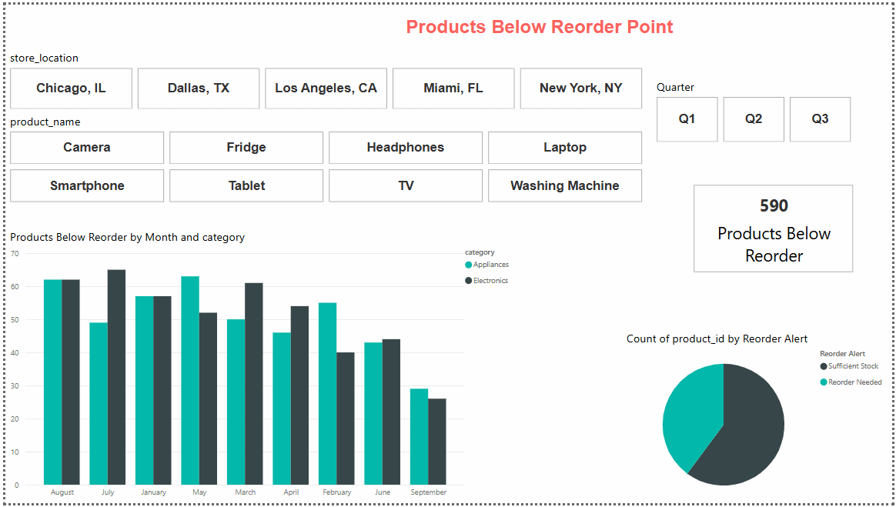
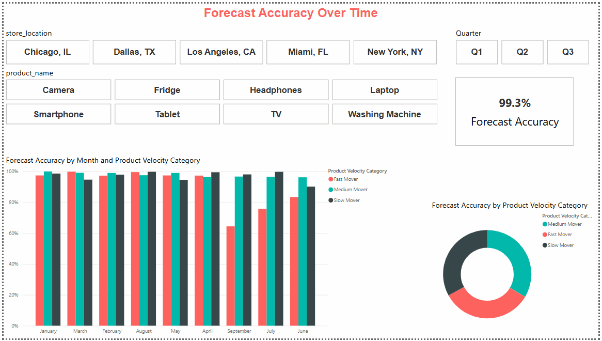

***

<h1 align="center">Inventory Management Report</h1>

 This Power BI dashboard delivers a streamlined view into inventory optimization across products, stores, and suppliers. It focuses on core supply chain visibility metrics such as stock levels, reorder alerts, demand forecasting accuracy, and supplier performance. Designed to support smarter decision-making, the report enables teams to reduce stockouts, streamline replenishment cycles, and align inventory strategies with real customer demand and operational goals.

<h2>Key Features</h2>

- Compare inventory performance across stores by value, utilization, and availability
- Track how stock levels, reorder needs, and turnover evolve month over month
- Analyze product movement by category, demand velocity, and restock frequency
- Explore customer demand patterns by segment, age group, and loyalty level
- Identify suppliers and stores driving the highest revenue and fulfillment efficiency
- Detect stockouts, backorders, and low-stock items before they impact sales
- Measure the impact of weather, holidays, and forecast accuracy on inventory planning
- Drill into product-level metrics with dynamic filters for region, time, and category

***

<h3 align="center"> Section 1: Inventory Performance Overview </h3>

This section provides a holistic view of how inventory is performing across time, categories, and regions. It focuses on the health of stock levels, utilization efficiency, and how effectively inventory is turning over.

- `Current Inventory Status`: A snapshot of available stock across locations, highlighting what’s on hand and what's at risk of stockouts.
- `Monthly Inventory Value Trend`: Tracks how the total value of inventory is changing over time, helping identify cost patterns or overstocking.
- `Inventory Utilization Over Time`: Measures how efficiently inventory is being consumed relative to what's available, signaling performance and waste.
- `Inventory Turnover by Product Category`: Analyzes how often stock is sold and replaced, broken down by category to pinpoint fast- and slow-moving items.
- `Stock Availability Distribution`: Visualizes the percentage of in-stock products across the board, highlighting overall availability and service level.

 

  <strong>Current Inventory Status</strong> 
  

  <table>
    <tr>
      <td align="center" width="480">
        <strong>Monthly Inventory Value Trend</strong> 
        
      </td>
      <td align="center" width="480">
        <strong>Inventory Utilization Over Time</strong> 
        
      </td>
    </tr>
    <tr>
      <td align="center" width="480">
        <strong>Inventory Turnover by Product Category</strong> 
        
      </td>
      <td align="center" width="480">
        <strong>Stock Availability Distribution</strong> 
        
      </td>
    </tr>
  </table>

 

---

<h3 align="center"> Section 2: Product Movement & Replenishment </h3>

This section dives into how products flow through the system—from sales velocity to restocking needs—ensuring timely replenishment and minimal disruption.

- `Product Velocity Trend`: Shows how quickly products are selling, helping identify high-demand items and those at risk of stagnation.
- `Reorder Quantity Over Time`: Tracks how reorder needs evolve month by month, aiding procurement planning and buffer stock decisions.
- `Products Below Reorder Point`: Flags items that have dropped below safe inventory levels, enabling proactive restocking.
- `Excess Inventory Trend`: Highlights accumulation of unsold or overstocked items, helping reduce holding costs and improve shelf efficiency.

 

  <table>
    <tr>
      <td align="center" width="480">
        <strong>Product Velocity Trend</strong> 
        
      </td>
      <td align="center" width="480">
        <strong> Reorder Quantity Over Time</strong> 
        
      </td>
    </tr>
    <tr>
      <td align="center" width="480">
        <strong>Products Below Reorder Point</strong> 
        
      </td>
      <td align="center" width="480">
        <strong>Excess Inventory Trend</strong> 
        
      </td>
    </tr>
  </table>

 

---

<h3 align="center"> Section 3: Customer Demand & Behavior </h3>

This section focuses on customer-driven demand patterns and buying behavior to align inventory planning with real consumption.

- `Revenue by Customer Segment`: Compares sales across loyalty tiers to understand which groups contribute most to revenue.
- `Revenue by Customer Categories`: Breaks down sales by demographic categories like income or gender, helping tailor inventory to demand profiles.
- `Repeat vs First-Time Purchase Share`: Identifies the ratio of new versus returning customers, offering insight into loyalty and purchase cycles.
- `Age Group Demand Analysis`: Tracks which age groups are driving product demand, allowing for targeted inventory and marketing strategies.

 

  <table>
    <tr>
      <td align="center" width="480">
        <strong>Revenue by Customer Segment</strong> 
        
      </td>
      <td align="center" width="480">
        <strong>Revenue by Customer Categories</strong> 
        
      </td>
    </tr>
    <tr>
      <td align="center" width="480">
        <strong>Repeat vs First-Time Purchase Share</strong> 
        
      </td>
      <td align="center" width="480">
        <strong>Age Group Demand Analysis</strong> 
        
      </td>
    </tr>
  </table>

 

---

<h3 align="center"> Section 4: Store & Supplier-Level Insights </h3>

This section evaluates performance at the store and supplier level, focusing on fulfillment efficiency and supply-side risks.

- `Revenue by Store`: Compares store-level performance, revealing top-performing and underperforming locations based on sales volume.
- `Reorder Cycle by Supplier`: Analyzes how frequently orders are placed with suppliers, providing insight into procurement rhythm and reliability.
- `Lead Time Breach Trends`: Monitors how often suppliers miss expected delivery windows, helping address delays and mitigate risks.
- `Lead Time Breach Weather Trends`: Correlates delivery delays with weather patterns to uncover external factors affecting supply reliability.

 

  <table>
    <tr>
      <td align="center" width="480">
        <strong>Revenue by Store</strong> 
        
      </td>
      <td align="center" width="480">
        <strong>Reorder Cycle by Supplier</strong> 
        
      </td>
    </tr>
    <tr>
      <td align="center" width="480">
        <strong>Lead Time Breach Trends</strong> 
        
      </td>
      <td align="center" width="480">
        <strong>Lead Time Breach Weather Trends</strong> 
        
      </td>
    </tr>
  </table>

 

---

<h3 align="center"> Section 5: External Influences & Forecast Accuracy </h3>

This section explores how external elements like weather and holidays impact demand, while also assessing how accurately demand was forecasted.

- `Forecast Accuracy Over Time`: Evaluates how well actual demand aligns with predictions, helping improve planning processes.
- `Forecast Error by Product`: Identifies where forecast deviations are most common, allowing adjustments in future projections.
- `Sales by Weather Conditions`: Highlights how different weather conditions influence customer purchases, helping plan seasonal stock.
- `Holiday Demand Spike`: Shows demand surges around holidays to support proactive stocking and promotion strategies.

 

  <table>
    <tr>
      <td align="center" width="480">
        <strong>Forecast Accuracy Over Time</strong> 
        
      </td>
      <td align="center" width="480">
        <strong>Forecast Error by Product</strong> 
        
      </td>
    </tr>
    <tr>
      <td align="center" width="480">
        <strong>Sales by Weather Conditions</strong> 
        
      </td>
      <td align="center" width="480">
        <strong>Holiday Demand Spike</strong> 
        
      </td>
    </tr>
  </table>

---

 

This inventory analytics report unifies operational, customer, and environmental insights into a single, data-driven view of supply chain performance. By integrating demand forecasting metrics, supplier performance indicators, and stock-level intelligence, it empowers decision-makers to minimize inventory risks, enhance fulfillment reliability, and drive continuous inventory optimization across the supply chain.

